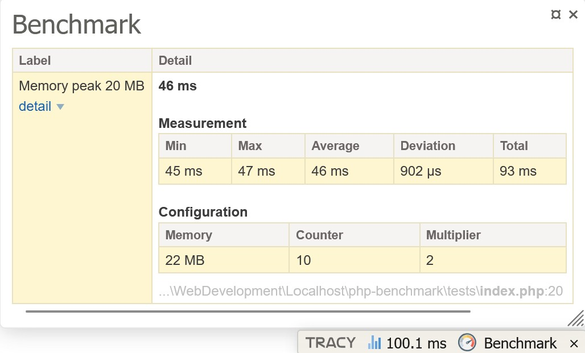

**[Back](../README.md)**

# Nette Tracy integration
The performance panel can be used in any project that uses Tracy, whether via the Nette Framework or standalone.

## Nette Framework (NEON)
Register the panel in your config.neon:
```neon
tracy:
	bar:
		- Matraux\PhpBenchmark\Bridge\Tracy\BenchmarkPanel
```

## Tracy standalone
If you are not using Nette DI, you can manually register the panel:
```php
use Matraux\PhpBenchmark\Bridge\Tracy\BenchmarkPanel;
use Tracy\Debugger;

Debugger::getBar()->addPanel(new BenchmarkPanel());
```

## Sample measurement code
```php
use Matraux\PhpBenchmark\Benchmark\Benchmark;

$performance = Benchmark::create();
$performance->counter = 10;
$performance->multiplier = 2;

$performance->label = 'Memory peak 20 MB';
$performance->run(function (): string {
	return str_repeat(' ', 20 * 1024 * 1024);
});
```

